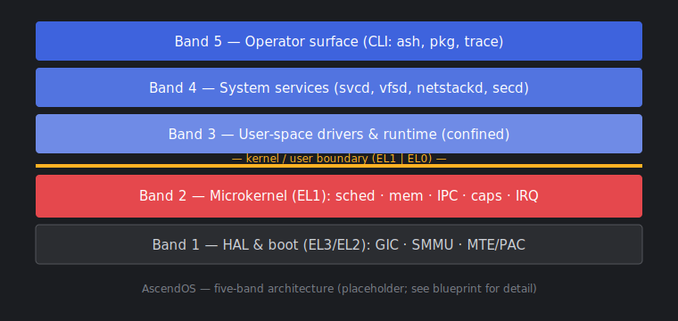

# AscendOS

*A capability-based ARM64 microkernel — design blueprint, pre-implementation.*

-orange)

> **Status: this is a design document, not working software.** There is no code
> here yet, nothing boots, and nothing is benchmarked. This repository holds the
> architecture blueprint, the decisions behind it, and the reasoning we want to
> get right *before* writing a kernel. If you came looking for an OS to run, it
> doesn't exist yet — but the design is open and the critique is welcome.

## What this is

AscendOS is a from-scratch design for a small ARM64 operating system: a
capability-based microkernel, drivers and services in user space, and a
command-line-only userland. No GUI subsystem, ever. The goal is a system whose
trusted computing base is small enough to reason about, that boots fast, and
that stays honest about where authority lives.

This repo is the blueprint plus the paper trail. Read the
[architecture](docs/architecture/) and the
[decision records](docs/adr/) to see not just *what* the design is, but *why* —
including the alternatives we looked at and turned down.

## What this is not (yet)

- Not bootable. There is no kernel image, no toolchain, no QEMU target.
- Not benchmarked. Any performance numbers in the docs are *targets*, labelled
  as such.
- Not stable. The design will change as people poke holes in it.

## Why another OS?

Most general-purpose kernels carry decades of accumulated surface area. The
microkernel research lineage (seL4, Genode) and the newer systems-language
efforts (Redox, Fuchsia/Zircon) show another path is viable: keep the kernel
tiny, push policy into user space, and make authority explicit. AscendOS is an
attempt to take those ideas and design a coherent, ARM64-first, CLI-only system
around them — small enough to be a teaching artifact and serious enough to be a
real bring-up target later.

We are standing on other people's work. See [Prior art](#prior-art--thanks).

## Design principles

- **No ambient authority.** Everything you can do, you can do because you hold a
  capability for it — *because* that makes the security model something you can
  actually reason about rather than audit forever.
- **Drivers live in user space.** A faulty NIC driver should not be able to
  corrupt the kernel — *because* isolation is cheaper to design in than to add
  later.
- **The kernel is mechanism, not policy.** Scheduling policy, paging policy,
  naming — all in user space — *because* a small kernel is a kernel you can hope
  to verify.
- **Syscalls are the slow path.** High-frequency I/O goes through shared-memory
  rings (io_uring-style) — *because* trap overhead dominates at scale.
- **CLI only.** No compositor, no framebuffer stack — *because* every subsystem
  you don't ship is one you don't have to secure.

## The shape of it

*(Diagram source lives in [`docs/diagrams/`](docs/diagrams/). The full
five-band breakdown is in the [blueprint](blueprint/AscendOS-Architecture-Blueprint.md).)*

## How to read this repo

1. Start with [overview/motivation](docs/overview/motivation.md) and
   [non-goals](docs/overview/non-goals.md).
2. Read the [architecture pages](docs/architecture/) in order — boot first.
3. Dig into the [ADRs](docs/adr/) for the contested decisions.
4. Check the [roadmap](ROADMAP.md) for where this is going and what's uncertain.

The canonical, single-file master spec is
[`blueprint/AscendOS-Architecture-Blueprint.md`](blueprint/AscendOS-Architecture-Blueprint.md).
The `docs/` pages are split views of it for the documentation site.

## Contributing

Right now the most useful contributions are not code:

- **Read [ADR-0003](docs/adr/0003-ring-based-syscall-interface.md) and tell us
  where it's wrong.** The ring interface is the design's biggest bet.
- Find gaps or contradictions in the architecture pages.
- Propose a change through the [RFC process](docs/rfcs/README.md).

See [CONTRIBUTING](.github/CONTRIBUTING.md) and the
[governance model](.github/GOVERNANCE.md) before opening a large proposal.

## Prior art & thanks

This design borrows heavily and openly from **seL4** (capabilities, untyped
memory, the verifiability mindset), **Genode** (component architecture),
**Redox** (a modern systems-language OS done in the open), and
**Fuchsia/Zircon** (user-space drivers, object/handle model). Mistakes in
adapting their ideas are ours.

## License

- Documentation and design content: **CC BY 4.0** (see [LICENSE](LICENSE)).
- Future source code: intended **MIT OR Apache-2.0**. See
  [LICENSE](LICENSE) for the rationale and current state.

## Maintainer

Maintained by [@AwaleSagar](https://github.com/AwaleSagar). This is currently a
single-maintainer project — see [GOVERNANCE](.github/GOVERNANCE.md) for how that
is expected to change.
