# AscendOS — ARM64 Microkernel OS

## Master Architecture Blueprint (Figma-Ready Specification)

> **Scope:** Architecture diagram specification only. No source code.
> **Target:** ARM64 (ARMv8.2-A+ / ARMv9-A), CLI-only, no GUI subsystem.
> **Design era:** 2026+ design conventions.
> **Purpose:** Direct translation into a Figma master diagram and the canonical reference for kernel development.

---

## 0. Research Basis (Design Decisions Grounded in Modern Trends)

| Trend (2024–2026) | Decision in AscendOS |
|---|---|
| Capability-based microkernels (seL4, Redox, Fuchsia/Zircon) | Pure capability model; no ambient authority |
| Formal verification momentum (seL4, Rust kernels) | Kernel written in a memory-safe systems language; verifiable TCB < 15 KLOC |
| Async, completion-based I/O (io_uring) | Shared-memory ring queues for ALL syscalls; syscalls become the slow path |
| EEVDF / capacity-aware scheduling | Latency-virtual-deadline scheduler, DynamIQ big.LITTLE aware |
| ARMv9 confidential compute (CCA / Realms), MTE, PAC, BTI | First-class memory tagging, pointer auth, realm isolation |
| Measured + secure boot (TPM/DICE, fTPM) | DICE-based layered attestation chain |
| Driver isolation in user space (Fuchsia, microkernels) | All drivers are user-space capability-confined processes |
| Declarative, immutable, atomic package systems (Nix, OSTree) | Content-addressed, atomic, rollback-capable packages |
| eBPF-style safe extensibility | Sandboxed bytecode VM for observability + policy hooks |

---

## 1. Top-Level System Layering (The Spine)

This is the primary vertical diagram — the backbone of the Figma canvas. Five horizontal bands, kernel/user boundary drawn as a bold line between Band 2 and Band 3.

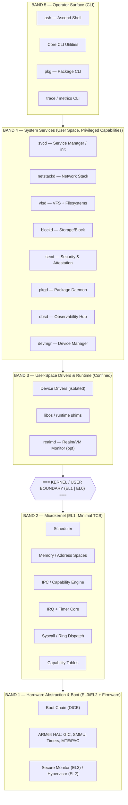

**Figma layout note:** Render Bands 3–5 in one color family (user space, cool blue), Band 2 in a single high-contrast color (kernel, warm red), Band 1 in neutral graphite (hardware/firmware). The kernel/user boundary line is the single most important visual element — make it a 4px bold divider with the `EL1 | EL0` label centered.

---

## 2. ARM64 Privilege & Exception-Level Map

The substrate the whole design hangs on. One small reference block in a corner of the canvas.

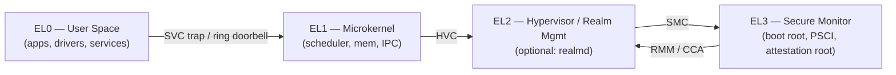

- **EL3 Secure Monitor:** PSCI power management, SMC dispatch, attestation root-of-trust, world switch.
- **EL2:** reserved for optional `realmd`; normally idle to preserve minimal footprint.
- **EL1:** the entire AscendOS microkernel. Target TCB ≤ 15 KLOC.
- **EL0:** everything else, including drivers.

---

## 3. Boot Sequence (Layered Boot Path Diagram)

A dedicated horizontal swimlane diagram. Each stage measures the next (DICE layering) — draw the measurement arrows as dashed upward lines into the TPM/attestation column.

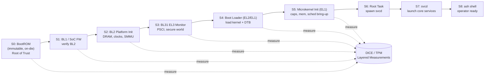

**Boot path responsibilities table:**

| Stage | EL | Responsibility | Footprint Target |
|---|---|---|---|
| S0 BootROM | EL3 | Verify first mutable stage, derive CDI | n/a (ROM) |
| S1 BL1 | EL3 | Minimal init, verify BL2 signature | < 64 KB |
| S2 BL2 | EL3 | DRAM/clock/SMMU init, load BL31 | < 256 KB |
| S3 BL31 | EL3 | Install secure monitor, PSCI | < 128 KB |
| S4 Loader | EL2→EL1 | Parse DTB, relocate kernel, pass boot caps | < 128 KB |
| S5 Kernel init | EL1 | Page tables, cap space, per-CPU sched, IRQ | kernel image < 256 KB |
| S6 Root task | EL0 | Holds all bootstrap capabilities, hands to svcd | minimal |
| S7 svcd | EL0 | Dependency-ordered parallel service launch | — |
| S8 ash | EL0 | Operator login / CLI | — |

**Cold-boot target:** power-on → shell prompt in < 250 ms on reference SoC.

---

## 4. Microkernel Internals (Band 2 Detail)

The single most detailed block in the diagram. Expand into a sub-canvas / Figma component with internal sub-blocks.

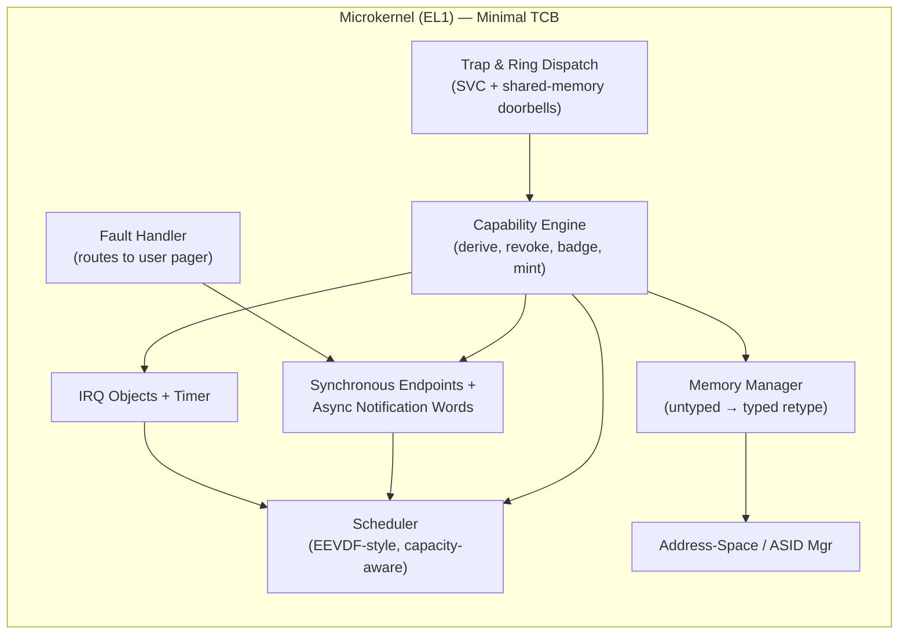

### 4.1 Component Responsibilities

- **Trap & Ring Dispatch:** Two entry paths. (a) Classic `SVC` trap for control ops. (b) **io_uring-style shared-memory submission/completion rings** per thread for high-frequency calls — the kernel polls/wakes on doorbell, eliminating most trap overhead. This is the defining performance feature.
- **Capability Engine:** All authority is an unforgeable capability stored in kernel-managed CSpace. Operations: `mint`, `derive`, `badge` (identity tagging), `revoke` (recursive). No ambient authority anywhere — mirrors seL4/Zircon.
- **Scheduler:** Per-CPU runqueues, EEVDF-style virtual-deadline fairness, **capacity-aware placement** for DynamIQ big.LITTLE (E-cores vs P-cores), scheduling contexts (CPU budget is itself a capability → enables hard real-time + safe over-commit). Work-stealing across same-cluster cores.
- **Memory Manager:** Single physical-memory model via **untyped → retype** (seL4 pattern): all kernel objects are user-allocated from untyped capabilities, so the kernel never has an internal heap → no in-kernel OOM, fully accountable memory. ARMv9 **MTE** tags enforced; **PAC/BTI** for control-flow integrity.
- **Address-Space / ASID Manager:** Multi-level translation tables, ASID recycling, optional 52-bit VA, contiguous-hint (block) mappings for TLB efficiency.
- **IPC:** Synchronous fastpath endpoints (register-passed short messages) + asynchronous **notification words** (bitfield signals). Zero-copy bulk transfer via shared-frame capability grants.
- **IRQ + Timer:** IRQs are capability objects delivered as notifications to user-space drivers; per-CPU generic timer; tickless idle.
- **Fault Handler:** Page/permission faults are converted to IPC messages routed to the responsible **user-space pager** — kernel itself never does demand paging policy.

### 4.2 What is explicitly NOT in the kernel
Filesystems, network stack, drivers, paging policy, package logic, naming/discovery, scheduling *policy* beyond the mechanism. All in user space.

---

## 5. Kernel Objects & Capability Model

Reference table block — pair with a small entity diagram.

| Object | Represents | Key Operations |
|---|---|---|
| `Untyped` | Raw physical memory region | retype → any object |
| `CNode` | Capability storage slot array | copy, mint, delete |
| `TCB` | Thread control block | configure, resume, bind sched-context |
| `Endpoint` | Synchronous IPC port | send, recv, call, reply |
| `Notification` | Async signal word | signal, wait, poll |
| `Frame` | Mappable page | map, unmap, grant |
| `PageTable` | Translation level | map into ASID |
| `IRQHandler` | A hardware interrupt line | ack, set-notification |
| `SchedContext` | CPU time budget | bind, refill params |
| `RealmCap` | Confidential VM context (opt) | create, attest, enter |

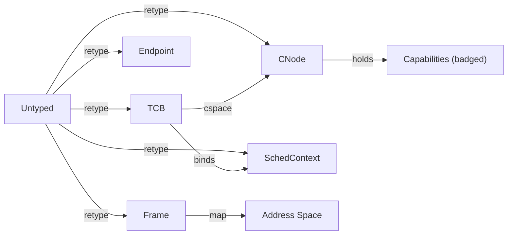

---

## 6. IPC & Data Flow (The Nervous System)

Show this as a request/response sequence — it explains how a syscall-free, ring-based, capability-confined system actually moves data.

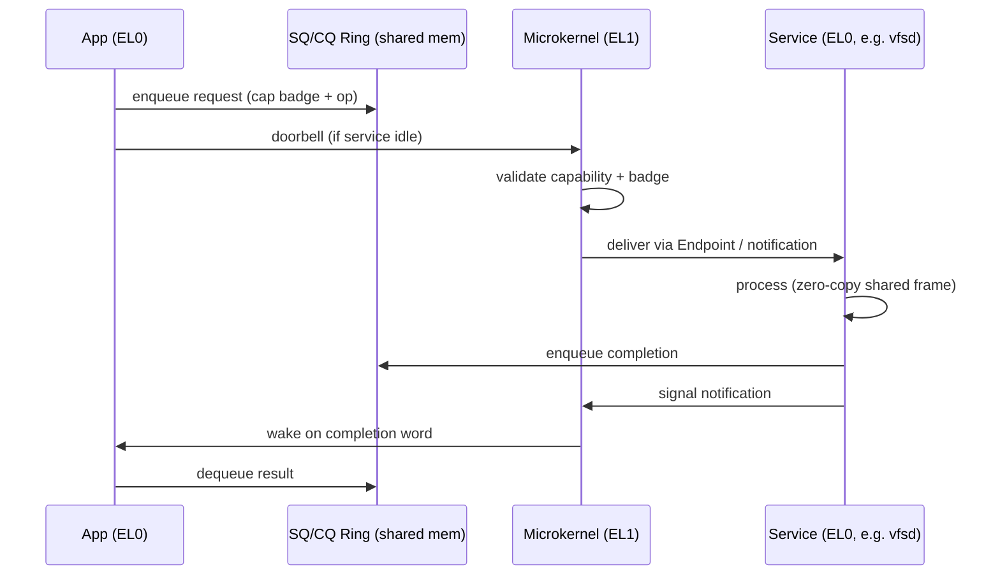

**Data-flow principles for the diagram:**
1. **Control plane** (capability checks, wakeups) = solid red arrows through kernel.
2. **Data plane** (bulk bytes) = green arrows that *bypass* the kernel via shared frames — draw them going around Band 2, never through it. This visual asymmetry is the whole point.
3. Every cross-process arrow must originate from a held capability badge.

---

## 7. System Services Mesh (Band 4 Detail)

Each service is an isolated EL0 process holding a precise capability set. Draw as a hub diagram with `svcd` at center and dependency arrows.

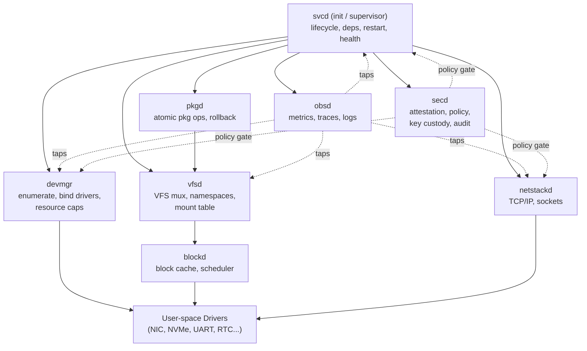

### Service responsibilities

- **svcd:** PID 1 equivalent. Declarative dependency graph, parallel start, capability handout, supervision/restart with backoff, health probes, socket/endpoint activation (lazy start).
- **devmgr:** Walks the device tree (DTB) / ACPI, allocates MMIO + IRQ + DMA(SMMU) capabilities, matches and spawns the correct driver process, hot-plug events.
- **secd:** Holds attestation evidence, evaluates policy (capability-grant decisions), key custody, immutable audit log, secure-boot/runtime measurement verification.
- **vfsd:** Per-process composable namespaces (Plan 9-influenced), mount table, path resolution, mux to filesystem implementations.
- **netstackd:** User-space TCP/IP, sockets-as-capabilities, zero-copy via shared frames with NIC driver.
- **pkgd:** Content-addressed store, atomic transactional install/upgrade/rollback, generation management.
- **obsd:** Aggregates metrics/traces/logs, hosts the safe-bytecode probe VM, exposes the CLI query surface.

---

## 8. Storage Subsystem

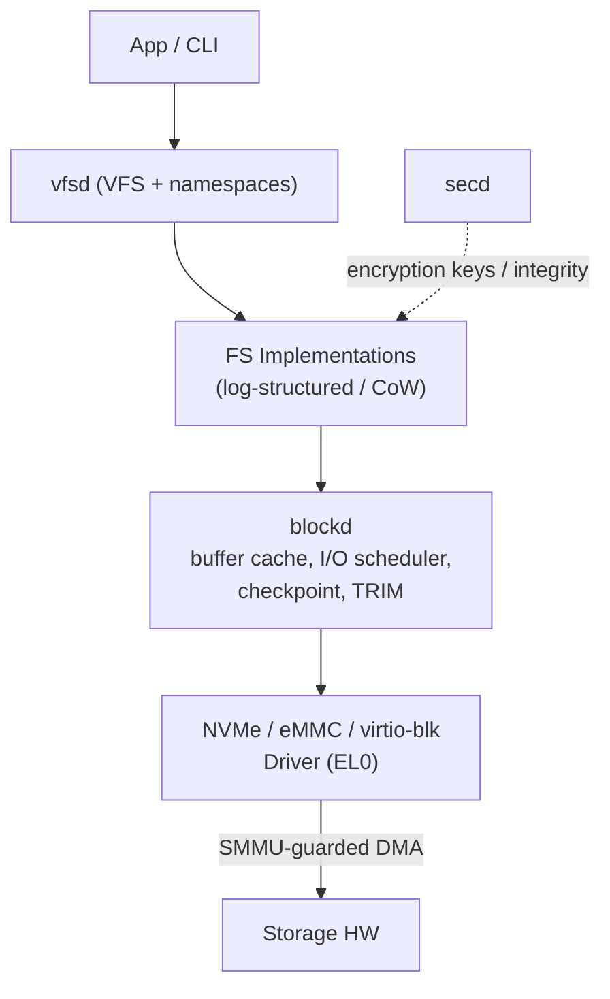

- **Filesystem:** Copy-on-write + log-structured hybrid; per-block checksums; atomic snapshots feeding `pkgd` rollback.
- **blockd:** Unified buffer cache, deadline/budget-aware I/O scheduler, write barriers, async via completion rings.
- **Integrity:** Optional per-file authenticated encryption with keys custodied by `secd`; dm-verity-style integrity trees for the immutable base image.
- **DMA safety:** All device DMA passes through **SMMU** translation scoped by capability — a driver can only touch frames it was granted.

---

## 9. Networking Stack

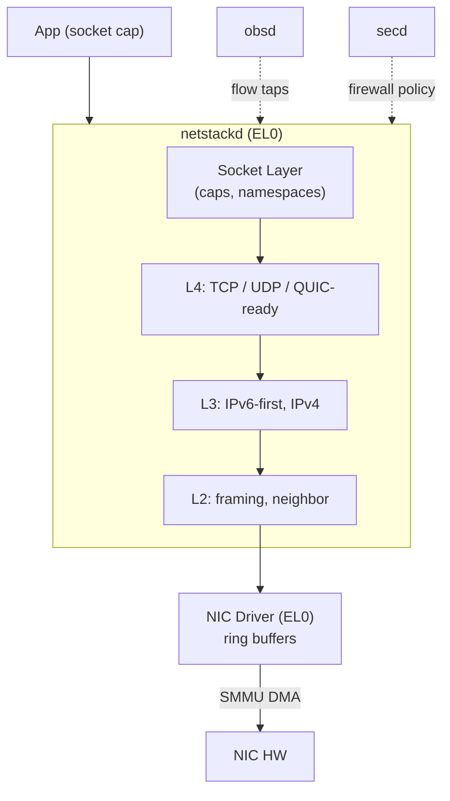

- **IPv6-first**, dual-stack; QUIC-ready L4; pluggable congestion control.
- **Zero-copy** RX/TX via shared frames between `netstackd` and NIC driver.
- **Sockets are capabilities** — no global port namespace ambient authority; firewall = capability policy enforced via `secd`.
- **Offload-aware:** checksum/segmentation offload negotiated through driver caps.

---

## 10. Device Driver Model

The "drivers in user space" story — a key differentiator. Draw the isolation boundary boldly.

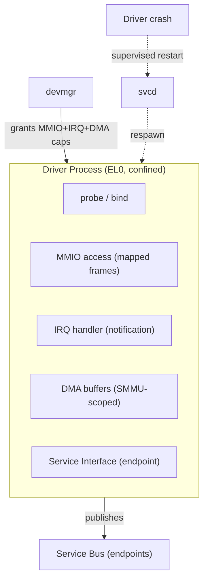

- **Isolation:** A faulty driver cannot corrupt the kernel or other drivers — it only holds its own MMIO/IRQ/DMA capabilities. Crash → `svcd` restarts it; state recovered from checkpoints where applicable.
- **Uniform contract:** every driver exposes a typed endpoint interface (block, net, char, bus).
- **Bus drivers:** PCIe, USB, I2C/SPI as their own confined processes that hand child capabilities to leaf drivers.
- **Hot-plug:** `devmgr` reacts to bus events, spawns/reaps driver processes dynamically.

---

## 11. Security Framework (Cross-Cutting Overlay)

Render as a translucent overlay panel touching every band — security is not a layer, it's a property.

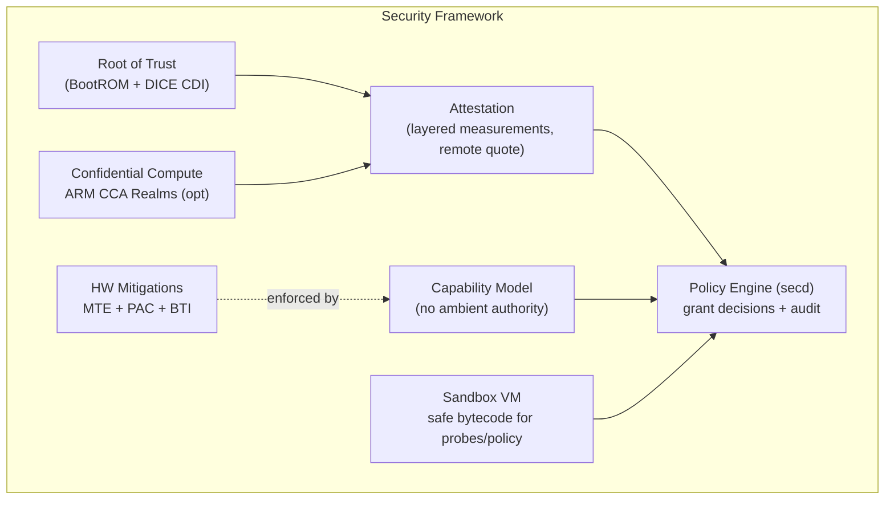

| Pillar | Mechanism |
|---|---|
| Authority | Pure capabilities; least privilege by construction |
| Boot integrity | Secure boot + DICE layered attestation |
| Memory safety | Safe systems language kernel + MTE tagging |
| Control-flow integrity | PAC (pointer auth) + BTI (branch target) |
| Isolation | Per-process address spaces, SMMU for DMA, user-space drivers |
| Confidential compute | ARMv9 CCA Realms via optional `realmd`/EL2 |
| Policy & audit | `secd` central decision point, append-only audit log |
| Safe extensibility | Verified bytecode sandbox (eBPF-class), no native kernel modules |

---

## 12. Package Management

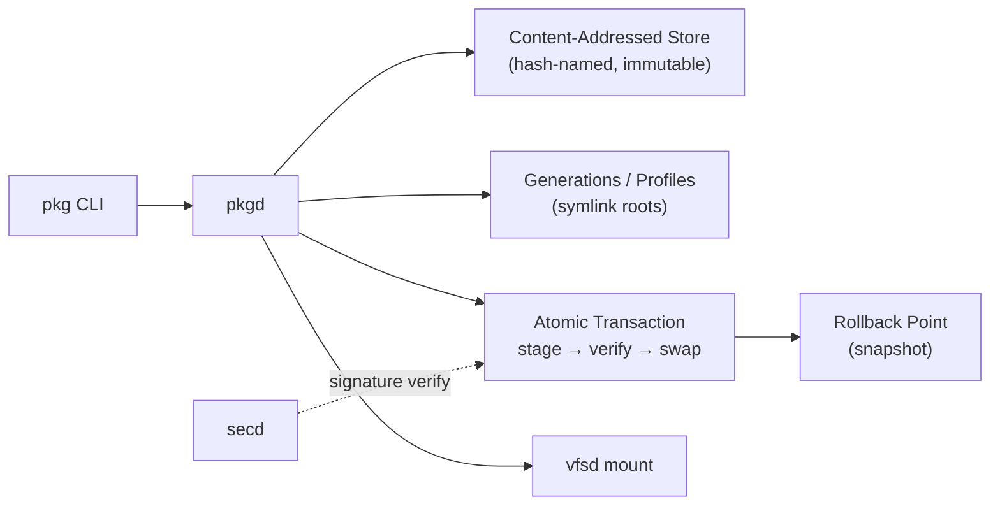

- **Immutable, content-addressed** store (Nix/OSTree lineage): no in-place mutation, perfect reproducibility.
- **Atomic activation:** stage new generation → verify signatures via `secd` → atomic root swap; failure rolls back instantly.
- **Declarative:** desired system state expressed as a manifest; `pkgd` reconciles.
- **A/B base image** support for safe OS upgrades.

---

## 13. Observability Layer

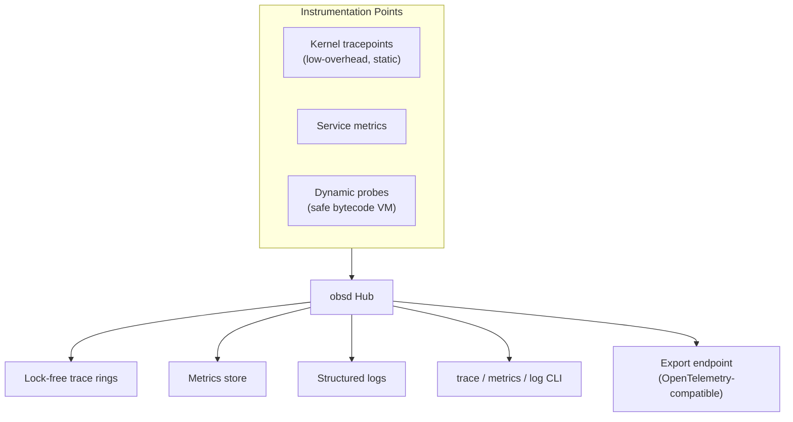

- **Always-on, low overhead:** static tracepoints compile out to near-zero cost when disabled.
- **Dynamic probes:** attach safe bytecode at runtime (no recompile, no native modules) — eBPF-class capability.
- **Unified pipeline:** metrics + traces + logs through one hub; OTel-compatible export.
- **CLI-native:** `trace`, `metrics`, `log` tools query `obsd` directly over endpoints.

---

## 14. CLI / Operator Surface (Band 5)

- **ash (Ascend Shell):** capability-aware shell — a process inherits only the capabilities the shell explicitly grants; job control, pipelines, namespaces.
- **Core utilities:** coreutils-equivalent, statically composed against `libos`.
- **Admin tools:** `svc` (service control), `pkg`, `dev` (device inspector), `cap` (capability inspector), `trace`/`metrics`/`log`.
- **No GUI subsystem whatsoever** — no compositor, no framebuffer stack, no font/render path. Serial + virtual console only.

---

## 15. Memory Footprint Budget (Minimalism Targets)

| Component | Target Resident |
|---|---|
| Microkernel (EL1) | < 256 KB image, < 1 MB runtime |
| svcd | < 512 KB |
| Each driver | 256 KB – 1 MB |
| netstackd | < 4 MB |
| vfsd + blockd | < 6 MB |
| Idle full system (no apps) | **< 32 MB RAM** |
| Minimum boot config | **< 16 MB RAM** |

---

## 16. Future Extensibility Hooks

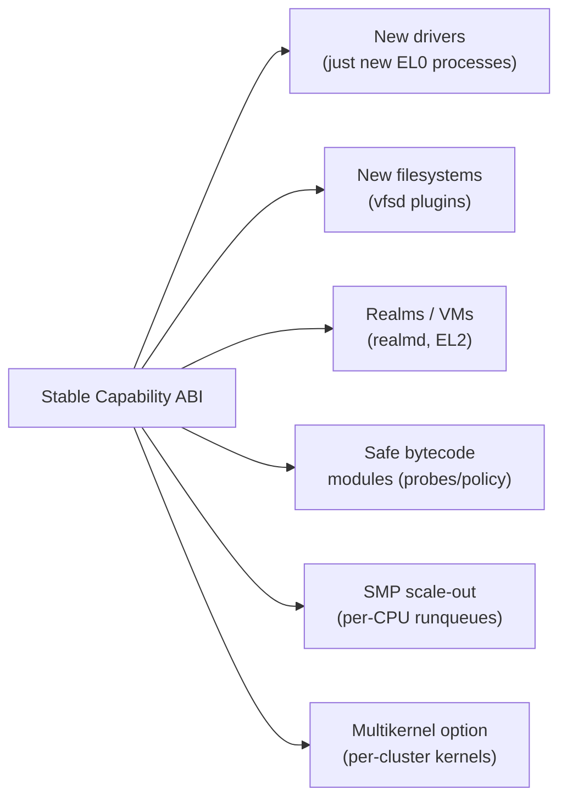

- **Stable capability ABI** is the only frozen contract; everything above evolves freely.
- **No native kernel modules ever** — extension happens in user space or via the sandbox VM, preserving the verifiable TCB.
- **Scale path:** single core → SMP → NUMA-aware → optional multikernel per cluster.

---

## 17. Figma Construction Guide (How to Lay This Out)

**Canvas:** one large frame, portrait, ~1920 × 4000.

**Color system:**
- Hardware/firmware (Band 1): graphite `#2B2D31`
- Kernel (Band 2): signal red `#E5484D`
- User space (Bands 3–5): blues `#3E63DD` → `#8DA4EF` gradient by altitude
- Security overlay: translucent amber `#FFB224` @ 15% opacity spanning all bands
- Data plane arrows: green `#30A46C`; control plane arrows: red `#E5484D`

**Typography:** one mono family (e.g. Berkeley Mono / JetBrains Mono) for all component labels — reinforces the systems-level identity. 8px grid. 4px corner radius on every block.

**Components to make reusable (Figma components/variants):**
1. *Service block* (title + responsibility list + capability badge slot)
2. *Kernel object pill*
3. *Capability arrow* (with badge tag)
4. *Boot stage card* (stage / EL / footprint)
5. *EL band header*

**Layering order (z-index):**
1. Band backgrounds (bottom)
2. Component blocks
3. Dependency arrows
4. Security overlay (translucent, top)
5. The bold kernel/user boundary divider (always visible on top)

**Diagram set to produce on the canvas:**
1. §1 Spine (hero, top)
2. §2 EL map (top-right reference)
3. §3 Boot swimlane
4. §4 Kernel internals (expanded detail block)
5. §6 IPC sequence
6. §7 Service mesh
7. §8–§10 Subsystem trios (storage / net / drivers) side-by-side
8. §11 Security overlay legend
9. §12–§13 Package + observability
10. §16 Extensibility fan-out (bottom)

---

## 18. One-Page Summary Map (Everything At Once)

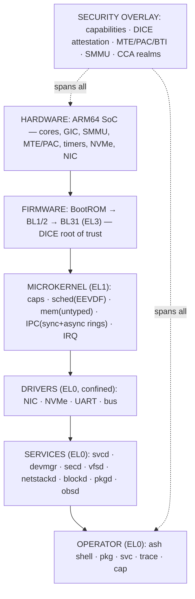

---

*End of blueprint. This document is the master reference; reproduce each numbered Mermaid block as a Figma diagram following §17.*
