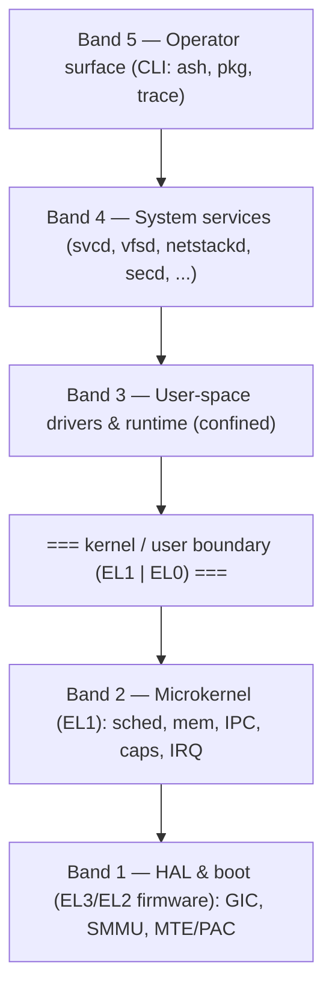

# Architecture

These pages are a navigable split of the single-file
[master blueprint](https://github.com/AwaleSagar/ascendos/blob/main/blueprint/AscendOS-Architecture-Blueprint.md).
The blueprint is the source of truth; if a page here ever contradicts it, the
blueprint wins (and that's a bug — please report it).

## The five-band model

AscendOS is organised as five horizontal bands, with a hard kernel/user boundary
between the microkernel (EL1) and everything above it (EL0).

## Reading order

1. [Boot](boot.md) — how the system comes up and establishes trust.
2. [Microkernel](microkernel.md) — what's actually in the EL1 TCB.
3. [Capabilities](capabilities.md) — the authority model everything rests on.
4. [Scheduling](scheduling.md) · [Memory](memory.md) · [IPC](ipc.md) — the core
   mechanisms.
5. [Drivers](drivers.md) · [Storage](storage.md) · [Networking](networking.md) —
   the user-space subsystems.
6. [Security](security.md) · [Packaging](packaging.md) ·
   [Observability](observability.md) — cross-cutting and operational layers.

!!! note "Page completeness varies"
    Some pages are detailed; others are honest stubs that point back to the
    relevant blueprint section. That asymmetry is intentional — we write depth
    where the design is settled and leave markers where it isn't.
