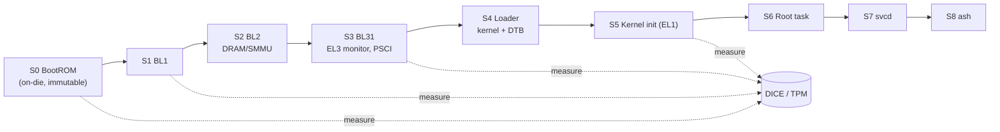

# Boot

The boot path is a chain of stages, each measuring the next before handing off
(DICE-style layered attestation). The trust the running system claims is only as
good as this chain, so it's the first thing to get right.

| Stage | EL | Responsibility | Footprint target |
|---|---|---|---|
| S0 BootROM | EL3 | Verify first mutable stage, derive CDI | ROM |
| S1 BL1 | EL3 | Minimal init, verify BL2 | < 64 KB |
| S2 BL2 | EL3 | DRAM, clocks, SMMU; load BL31 | < 256 KB |
| S3 BL31 | EL3 | Secure monitor, PSCI | < 128 KB |
| S4 Loader | EL2→EL1 | Parse DTB, relocate kernel, pass boot caps | < 128 KB |
| S5 Kernel init | EL1 | Page tables, cap space, per-CPU sched, IRQ | image < 256 KB |
| S6 Root task | EL0 | Holds bootstrap capabilities; spawns svcd | minimal |
| S7 svcd | EL0 | Dependency-ordered parallel service launch | — |
| S8 ash | EL0 | Operator login | — |

**Cold-boot target:** power-on → shell prompt in **< 250 ms** on a reference
SoC. *(Target, not a measurement — nothing boots yet.)*

## Open questions

- How much of the EL3/EL2 setup do we own vs. inherit from existing firmware
  (TF-A)? Reusing TF-A is pragmatic but enlarges the trust base we don't
  control.
- Where exactly does the DICE CDI derivation happen on boards without a
  hardware root of trust?

Full detail: blueprint §3.
