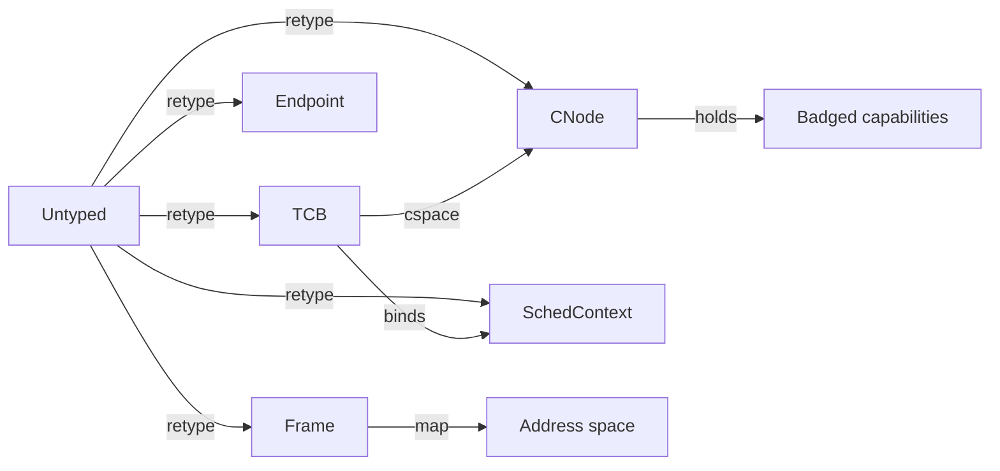

# Capabilities

Authority in AscendOS is exclusively held as capabilities: unforgeable,
kernel-managed references that name an object and the rights over it. There is no
ambient authority — no implicit power from identity. This is the single most
important design decision; see
[ADR-0001](../adr/0001-pure-capability-model.md).

## Kernel objects

| Object | Represents | Key operations |
|---|---|---|
| `Untyped` | Raw physical memory | retype → any object |
| `CNode` | Capability storage | copy, mint, delete |
| `TCB` | Thread | configure, resume, bind sched-context |
| `Endpoint` | Synchronous IPC port | send, recv, call, reply |
| `Notification` | Async signal word | signal, wait, poll |
| `Frame` | Mappable page | map, unmap, grant |
| `PageTable` | Translation level | map into ASID |
| `IRQHandler` | A hardware IRQ line | ack, set-notification |
| `SchedContext` | CPU time budget | bind, refill |
| `RealmCap` | Confidential VM context (opt) | create, attest, enter |

## Operations

- **mint** — create a new capability, optionally with reduced rights.
- **derive** — produce a child capability for delegation.
- **badge** — attach an identity tag, so a server can tell callers apart on one
  endpoint.
- **revoke** — recursively invalidate a capability and everything derived from
  it.

## Why this matters

Because authority is finite and explicit, "what can this process do?" is
answerable by listing its CSpace. Revocation is recursive and precise. There is
no `setuid`, no global filesystem permission to get wrong.

Full detail: blueprint §5.
