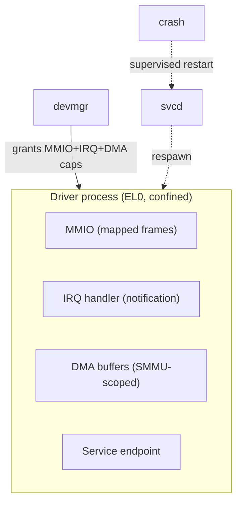

# Device drivers

Every driver is an ordinary EL0 process, confined to exactly the MMIO, IRQ, and
DMA capabilities `devmgr` grants it. See
[ADR-0002](../adr/0002-userspace-drivers.md).

- **Isolation:** a driver holds only its own resources. A crash can't corrupt
  the kernel or peers; `svcd` restarts it.
- **DMA safety:** all device DMA is translated by the **SMMU**, scoped to frames
  the driver was granted — a driver physically cannot DMA where it has no
  capability.
- **Uniform contract:** each driver exposes a typed endpoint (block, net, char,
  bus). Bus drivers (PCIe, USB, I2C/SPI) are themselves confined processes that
  hand child capabilities to leaf drivers.

## How the hardware actually enforces this (ARM specifics)

The isolation story rests on two ARM blocks, and getting the details right
matters:

- **SMMU stage-1 is the mechanism for user-space-driver DMA confinement.** Each
  DMA-capable device is identified by a **StreamID**; the SMMU uses a stage-1
  translation context per device so the device sees only an I/O virtual address
  space scoped to the frames it was granted. (Stage-2 is for VM/hypervisor use;
  for bare AscendOS drivers, stage-1 is the relevant one.) This is exactly the
  use case ARM documents for "userspace device driver" isolation.
- **Interrupts: GICv3/v4 with LPIs via the ITS.** Modern ARM interrupt delivery
  uses the GIC; message-signalled interrupts (MSIs) arrive as **LPIs** routed by
  the **ITS** (Interrupt Translation Service), where each device has a DeviceID.
  The kernel turns a delivered interrupt into a **notification** on the owning
  driver's IRQ capability. The blueprint should assume GICv3 as the baseline
  (GICv2 is legacy and lacks ITS/LPI scaling).

## Open question

- DeviceID/StreamID assignment and the SMMU/ITS configuration tables are
  themselves security-critical state. Which component owns them — `devmgr`, or a
  more privileged broker — needs a precise answer, since a wrong StreamID mapping
  breaks the DMA-isolation guarantee.

## Sources

- SMMU stage-1 user-space driver isolation, StreamID — Arm Developer, "What an
  SMMU does" / SMMU use cases; openEuler "Introduction to IOMMU and ARM SMMU".
- GICv3/v4, LPIs, ITS, DeviceID — Arm Developer "GIC fundamentals" and "GICv3/v4
  LPIs"; OSDev GICv3/4.

Full detail: blueprint §10.
