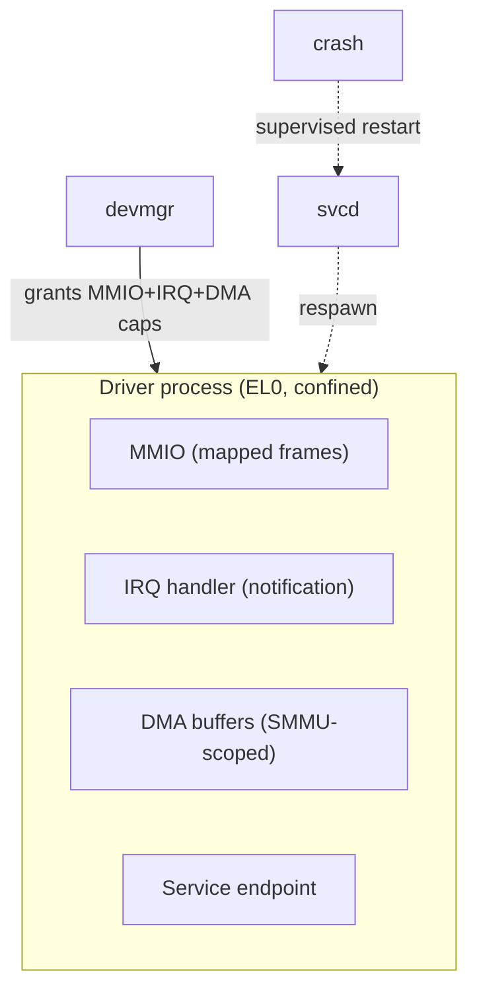

# Device drivers

Every driver is an ordinary EL0 process, confined to exactly the MMIO, IRQ, and
DMA capabilities `devmgr` grants it. See
[ADR-0002](../adr/0002-userspace-drivers.md).

- **Isolation:** a driver holds only its own resources. A crash can't corrupt
  the kernel or peers; `svcd` restarts it.
- **DMA safety:** all device DMA is translated by the **SMMU**, scoped to frames
  the driver was granted — a driver physically cannot DMA where it has no
  capability.
- **Uniform contract:** each driver exposes a typed endpoint (block, net, char,
  bus). Bus drivers (PCIe, USB, I2C/SPI) are themselves confined processes that
  hand child capabilities to leaf drivers.

Full detail: blueprint §10.
