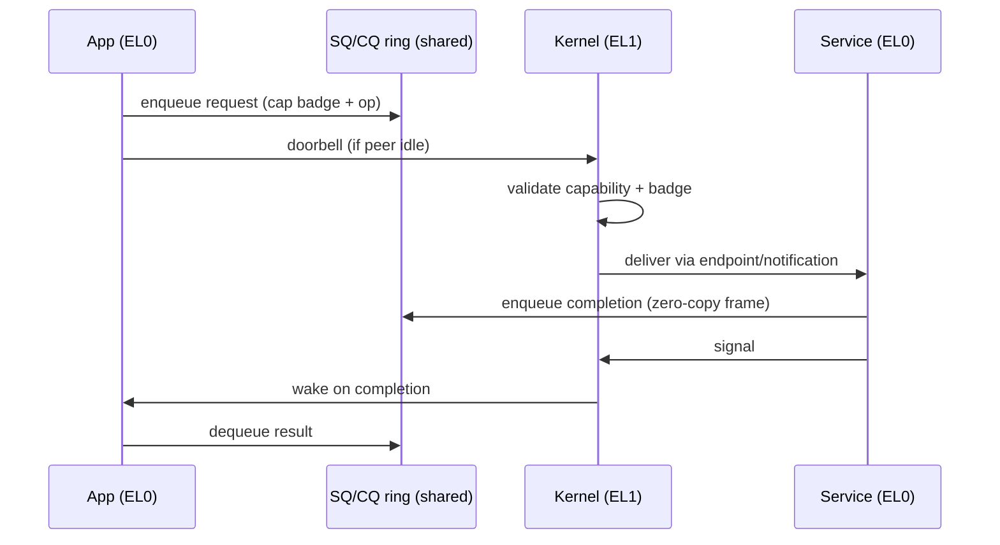

# IPC

Two complementary mechanisms, plus a zero-copy data path.

- **Synchronous endpoints** — register-passed short messages for the control
  plane (capability checks, RPC-style calls). A fastpath handles the common
  small-message case.
- **Asynchronous notifications** — a bitfield signal word for "something
  happened" without a rendezvous.
- **Shared-frame grants** — bulk data moves through frames mapped into both
  parties, *bypassing the kernel entirely*. The kernel is on the control path,
  never the data path.

The ring-based submission/completion model — making the trap the slow path — is
the design's central performance bet and is documented as
[ADR-0003](../adr/0003-ring-based-syscall-interface.md). **This is the page most
in need of critique.**

Full detail: blueprint §6.

## Sources

- seL4 IPC fastpath: "Correct, Fast, Maintainable — Choose Any Three!"
  (Trustworthy Systems, UNSW).
- seL4 whitepaper: IPC performance on ARM
  (<https://sel4.systems/About/seL4-whitepaper.pdf>).
- io_uring(7) manual page — shared ring buffer design
  (<https://man7.org/linux/man-pages/man7/io_uring.7.html>).
- ARM Architecture Reference Manual (ARM DDI 0487): AArch64 memory ordering,
    STLR/LDAR acquire-release semantics.
