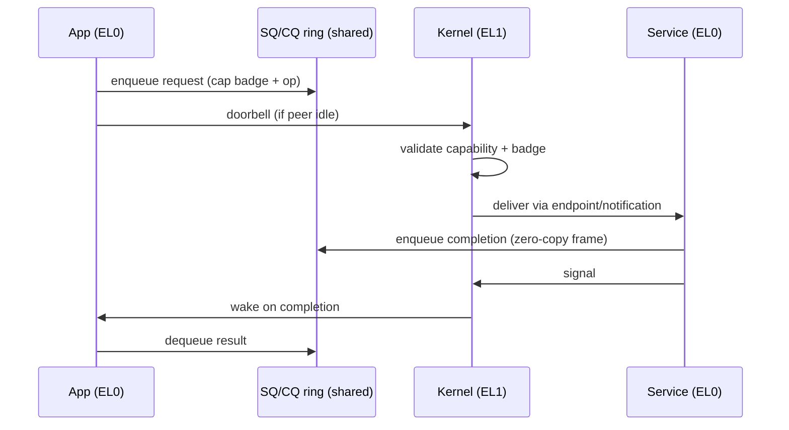

# IPC

Two complementary mechanisms, plus a zero-copy data path.

- **Synchronous endpoints** — register-passed short messages for the control
  plane (capability checks, RPC-style calls). A fastpath handles the common
  small-message case.
- **Asynchronous notifications** — a bitfield signal word for "something
  happened" without a rendezvous.
- **Shared-frame grants** — bulk data moves through frames mapped into both
  parties, *bypassing the kernel entirely*. The kernel is on the control path,
  never the data path.

The ring-based submission/completion model — making the trap the slow path — is
the design's central performance bet and is documented as
[ADR-0003](../adr/0003-ring-based-syscall-interface.md). **This is the page most
in need of critique.**

## The baseline we're trying to beat

The trap-based alternative is not slow in absolute terms, and we should be honest
about the bar. Published measurements put seL4's optimised fastpath round-trip
IPC at **~986 cycles intra-core** on the platform measured in the LionsOS study
(by comparison the same study cites 2,717 and 8,157 cycles for two other
kernels). That is the number the ring interface has to *meaningfully* beat to
justify its complexity and security cost — which is exactly why
[ADR-0003](../adr/0003-ring-based-syscall-interface.md) demands a prototype
measurement on real ARM hardware before the decision is treated as settled.

> Note on numbers: cycle counts are platform-specific and not comparable across
> SoCs. We cite the seL4 fastpath figure only as an order-of-magnitude baseline,
> not a target. (An earlier external review quoted "~1,830 cycles" for seL4 IPC;
> we could not source that and do not use it.)

## Sources

- seL4 fastpath optimisation: "Correct, Fast, Maintainable — Choose Any Three!"
  (Trustworthy Systems / APSys).
- Round-trip cycle figures: "Fast, Secure, Adaptable: LionsOS…" (arXiv
  2501.06234).

Full detail: blueprint §6.
