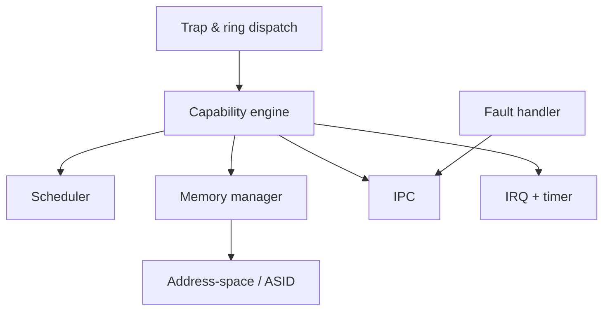

# Microkernel

Everything in this page runs at EL1 and is the entire trusted computing base.
The target is **≤ 15 KLOC**. If a feature can live in user space, it does not
belong here.

## What's in the kernel

- **Trap & ring dispatch** — two entry paths: classic `SVC` for control ops, and
  shared-memory submission/completion rings for high-frequency I/O. See
  [IPC](ipc.md) and [ADR-0003](../adr/0003-ring-based-syscall-interface.md).
- **Capability engine** — mint, derive, badge, revoke. The only source of
  authority. See [Capabilities](capabilities.md).
- **Scheduler** — EEVDF-style, capacity-aware for big.LITTLE. See
  [Scheduling](scheduling.md).
- **Memory manager** — untyped→retype allocation, no kernel heap. See
  [Memory](memory.md).
- **Address-space / ASID manager** — translation tables, ASID recycling.
- **IPC** — synchronous endpoints + async notification words.
- **IRQ + timer** — interrupts delivered to user-space drivers as notifications.
- **Fault handler** — page/permission faults become IPC to a user-space pager.

## What's deliberately *not* in the kernel

Filesystems, the network stack, drivers, paging policy, package logic, naming
and discovery, and scheduling policy beyond the mechanism. All user space.

Full detail: blueprint §4.
