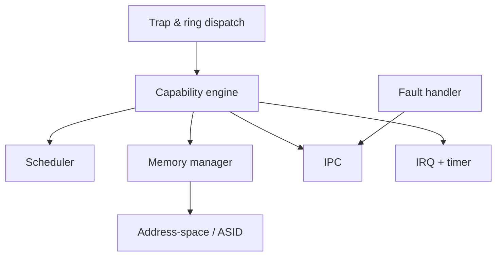

# Microkernel

Everything in this page runs at EL1 and is the entire trusted computing base.
The target is **≤ 15 KLOC**. If a feature can live in user space, it does not
belong here.

**TCB size context.** seL4's verified kernel is ~8,700 SLOC C + 600 asm (SOSP
2009) on ARM, growing to ~10,000–12,100 SLOC depending on architecture (seL4
FAQ). Our 15 KLOC target is above seL4's verified size — achievable with
discipline, but the ring interface ([ADR-0003](../adr/0003-ring-based-syscall-interface.md))
adds complexity that works against it. The kernel should be profiled by SLOC at
each milestone to keep this honest.

**Why every KLOC matters more than it looks.** Verification effort grows roughly
with the *square* of code size (Heiser / microkerneldude). So code the ring
interface adds to the TCB is super-linear proof cost, not linear — sharpening the
[ADR-0003](../adr/0003-ring-based-syscall-interface.md) tension: if formal
verification is a real goal, the ring may be unaffordable to prove, not merely
harder.

**"Memory-safe" is not "verified."** A memory-safe language (Rust) eliminates a
bug *class*; it does not prove the kernel meets a spec, and the `unsafe` code
kernels need (MMIO, page tables, the ring) sits outside the guarantee. The two
assurance levels are kept distinct by
[ADR-0007](../adr/0007-assurance-level-memory-safety-vs-verification.md); the
language and assurance target are a Phase 1 decision.

## What's in the kernel

- **Trap & ring dispatch** — two entry paths: classic `SVC` for control ops, and
  shared-memory submission/completion rings for high-frequency I/O. See
  [IPC](ipc.md) and [ADR-0003](../adr/0003-ring-based-syscall-interface.md).
- **Capability engine** — mint, derive, badge, revoke. The only source of
  authority. See [Capabilities](capabilities.md).
- **Scheduler** — EEVDF-style, capacity-aware for big.LITTLE. See
  [Scheduling](scheduling.md).
- **Memory manager** — untyped→retype allocation, no kernel heap. See
  [Memory](memory.md).
- **Address-space / ASID manager** — translation tables, ASID recycling.
- **IPC** — synchronous endpoints + async notification words.
- **IRQ + timer** — interrupts delivered to user-space drivers as notifications.
- **Fault handler** — page/permission faults become IPC to a user-space pager.

## What's deliberately *not* in the kernel

Filesystems, the network stack, drivers, paging policy, package logic, naming
and discovery, and scheduling policy beyond the mechanism. All user space.

Full detail: blueprint §4.
